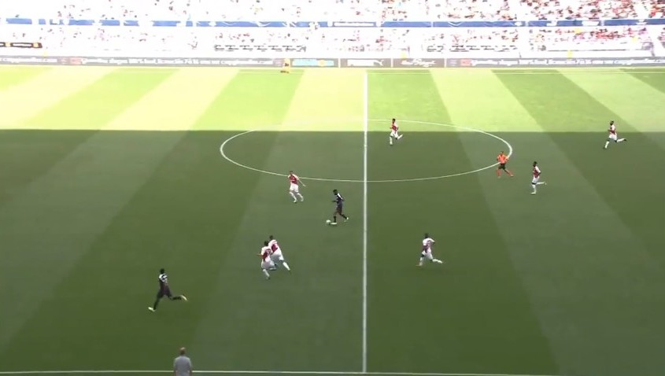
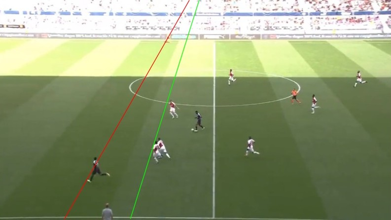
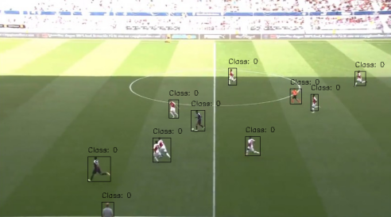

# Offside Detection Project

- **Attention: This tool is just a concept and is not a product.**
 - This project try to draw offside lines with use vanishing point method with two static and auto ways.
 - You can read documentation and see example code in **document.ipynb** file.

## Libraries that have been used :

- OpenCV
- Matplotlib
- Tkenter
- Numpy
- Ultralytics
- Threading

## OffsideClass Features :

-  Static line detection
-  Auto line detection
-  Player detection
-  Find vanishing point
-  Draw final offside lines
-  Image processing
-  Saveing result

### See examples of this tool in the images below :

Here is an example of an input image:

This is a example of final offside lines result:

Detected players on the image:

